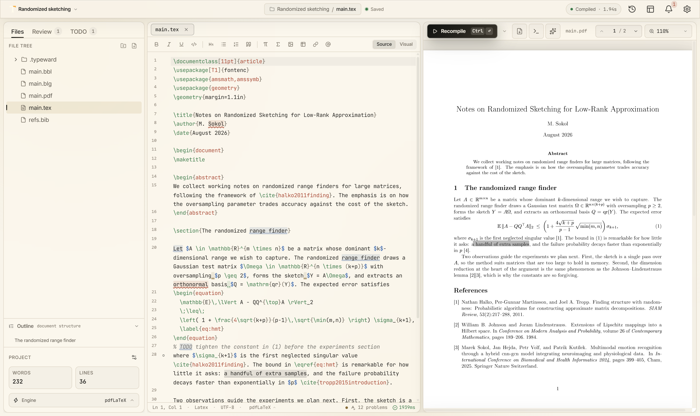

<div align="center">


# Typeward

**A LaTeX and Typst editor that runs on your machine. No account, no server, no paid tier.**

[](https://github.com/typeward/typeward/actions/workflows/tests.yml)
[](LICENSE)
[](#install)
[](#contributing)

</div>

Write, compile, and preview scientific documents the way you would in Overleaf:
split editor and PDF, SyncTeX, a reference library, templates. Except there is
no account to create, nothing to subscribe to, and no server holding your work.
Projects are ordinary folders on your disk that you can back up, version, and
open with any other tool.

Everything Typeward can do is available to everyone. Third-party services
(Zotero, Mendeley, WebDAV storage, git remotes, AI providers) are optional and
use your own credentials.

<div align="center">
  <picture>
    <source media="(prefers-color-scheme: dark)" srcset=".github/assets/hero-dark.png">
    
  </picture>
</div>

## Install

Version 0.1.0 is the first public alpha. Grab the installer for your system, or
browse [all releases](https://github.com/typeward/typeward/releases).

| System | Architecture | Installer |
| --- | --- | --- |
| Windows 10 and 11 | x86_64 | [`Typeward_0.1.0_x64-setup.exe`](https://github.com/typeward/typeward/releases/download/v0.1.0/Typeward_0.1.0_x64-setup.exe) |
| Windows 10 and 11 | ARM64 | [`Typeward_0.1.0_arm64-setup.exe`](https://github.com/typeward/typeward/releases/download/v0.1.0/Typeward_0.1.0_arm64-setup.exe) |
| macOS 13.3+ | Apple Silicon | [`Typeward_0.1.0_aarch64.dmg`](https://github.com/typeward/typeward/releases/download/v0.1.0/Typeward_0.1.0_aarch64.dmg) |
| macOS 13.3+ | Intel | [`Typeward_0.1.0_x64.dmg`](https://github.com/typeward/typeward/releases/download/v0.1.0/Typeward_0.1.0_x64.dmg) |
| Linux, glibc 2.35+ | x86_64 | [`.deb`](https://github.com/typeward/typeward/releases/download/v0.1.0/Typeward_0.1.0_amd64.deb), [`.rpm`](https://github.com/typeward/typeward/releases/download/v0.1.0/Typeward-0.1.0-1.x86_64.rpm), [`AppImage`](https://github.com/typeward/typeward/releases/download/v0.1.0/Typeward_0.1.0_amd64.AppImage) |
| Linux, glibc 2.35+ | ARM64 | [`.deb`](https://github.com/typeward/typeward/releases/download/v0.1.0/Typeward_0.1.0_arm64.deb), [`.rpm`](https://github.com/typeward/typeward/releases/download/v0.1.0/Typeward-0.1.0-1.aarch64.rpm), [`AppImage`](https://github.com/typeward/typeward/releases/download/v0.1.0/Typeward_0.1.0_aarch64.AppImage) |

See [Supported systems](#supported-systems) for which distributions each Linux
package covers and for the two platform caveats (WebView2 on Windows, and no
bundled Tectonic on the ARM64 Windows and Linux builds).

These installers are **not code-signed yet**, so SmartScreen and Gatekeeper will
warn on first run. Verify what you downloaded instead, against the `SHA256SUMS`
published with the release:

```
sha256sum -c SHA256SUMS --ignore-missing
gh attestation verify <file> --repo typeward/typeward
```

The second command checks GitHub's build provenance, proving the file was built
by this repository's release workflow from the tag it claims.

## Progress

Typeward is pre-1.0 and under active development. Everything checked below
ships today, in every build, for every user; unchecked items are on the
roadmap.

- [x] **LaTeX and Typst projects.** LaTeX compiles through your system TeX
      (`latexmk`, falling back to `pdflatex`) or through the bundled Tectonic
      sidecar, which needs no TeX installation. Typst compiles through the
      `typst` CLI on your PATH.
- [x] **PDF preview with SyncTeX.** Forward search from the cursor, inverse
      search by double-clicking the page. Compile errors and warnings are
      parsed into the editor gutter, with the raw log a click away.
- [x] **Chapter drafts for big documents.** After a full build, "Draft this
      chapter" recompiles only the chapter you are editing against the last
      build's cross-references (`\includeonly`), so one chapter of a
      book-length project redraws in seconds with its references and page
      numbers intact.
- [x] **A visual editor for `.tex`.** A hidden-source WYSIWYG mode toggled per
      file: the document on disk stays the verbatim source, and markup is
      edited through a popover rather than rendered inline. Source mode is
      always one click away.
- [x] **Language servers.** texlab for LaTeX and tinymist for Typst, if they
      are on your PATH: completion, diagnostics, hover, go-to-definition.
- [x] **Grammar checking on device.** Harper runs in-process in Rust; no text
      leaves the machine. Off by default, enabled in Settings.
- [x] **Markdown preview.** Open a `.md` file and the right pane renders it
      with KaTeX math, sandboxed and sanitized.
- [x] **Version history and recovery.** Saves are snapshotted into a local,
      content-addressed store you can browse and restore per file, and an
      autosave layer recovers unsaved buffers after a crash.
- [x] **Templates.** Built-in LaTeX and Typst starters with variable
      substitution, plus saving any open project back out as your own
      template.
- [x] **Local git.** Stage, commit, branch, clone, push, and pull over HTTPS
      via libgit2, riding your own git setup (gitconfig identity, credential
      helper).
- [x] **Overleaf import.** Import a project `.zip`, or clone the premium git
      bridge at `git.overleaf.com` with the same clone dialog.
- [x] **References.** Zotero (local or Web) and Mendeley are aggregated into a
      single `library.bib` inside the project, alongside DOI and arXiv
      lookups, so `\cite{}` completion works through the normal language
      server.
- [x] **WebDAV sync.** Bidirectional sync against Nextcloud, ownCloud, or any
      WebDAV host, with conflict detection that preserves both sides. No
      registered app needed.
- [x] **An optional AI assistant.** Claude, ChatGPT, Gemini, or a local
      Ollama, whichever you configure with your own key or daemon. Off by
      default; with it off, no AI code path runs and no AI request is made.
- [ ] **Stable 1.0 release.** Usable for real writing today, but rough edges
      are expected.
- [ ] **Merge-conflict UI for git.** Pulls are fast-forward only for now.
- [ ] **Mobile builds.** Tablet layouts and a WebAssembly TeX engine for
      iPadOS and Android exist in the tree, but only desktop builds ship.
- [ ] **Real-time collaboration.** Typeward is a single-user editor today.

## Supported systems

| Operating system            | Architectures        | Installers               |
| --------------------------- | -------------------- | ------------------------ |
| Windows 10 and 11           | x86_64, ARM64        | `.exe` (NSIS)            |
| macOS 13.3 or newer         | Apple Silicon, Intel | `.dmg`                   |
| Linux with glibc 2.35+      | x86_64, ARM64        | `.deb`, `.rpm`, AppImage |

Linux is one build per architecture rather than one per distribution. The
`.deb` covers the Debian family (Debian 12+, Ubuntu 22.04+, Mint, Pop!_OS,
elementary), the `.rpm` covers the RPM family (Fedora 36+, openSUSE, and the
RHEL derivatives), and the AppImage runs on anything else at or above that
glibc level, Arch and other rolling releases included. The glibc floor comes
from compiling on the oldest base Tauri 2 supports, which is what lets one
binary reach the widest range of distributions.

Two caveats. Windows needs the WebView2 runtime, which is preinstalled on
Windows 11 and installed on demand elsewhere. ARM64 builds for Windows and
Linux do not include the bundled Tectonic engine, so LaTeX there needs a TeX
distribution or a `tectonic` you install yourself; see
[Build from source](#build-from-source).

## Performance on large documents

Typeward is built to stay responsive on book-length projects, not only short
papers. The [`bench/`](bench/) directory holds a reproducible harness: it
generates a deterministic 143-chapter LaTeX book and drives Typeward,
TeXstudio 4.9.6, and LaTeX Workshop 10.17.1 (on VS Code) through the same
operations. The figures below are a representative run on one Windows 11
machine; [bench/README.md](bench/README.md) explains what each row measures,
the caveats, and how to reproduce them yourself.

|                                   | Typeward                  | TeXstudio 4.9.6 | LaTeX Workshop 10.17.1 |
| --------------------------------- | ------------------------- | --------------- | ---------------------- |
| Open to an editable buffer        | ~55 ms                    | ~1.1 s          | ~1.6 s                 |
| First `\cite` / `\ref` completion | ~0.4 ms (1287 candidates) | ~25 ms          | ~5-120 ms              |
| Switch to a chapter tab           | ~1 ms                     | ~1 ms           | ~23 ms                 |

## Build from source

**Prerequisites**

- **Node** `^20.19 || >=22.12` (Vite 8). CI uses 22.
- **Rust.** The toolchain is pinned in `rust-toolchain.toml`; with
  rustup installed, the right version is fetched automatically on first build.
- **Tauri 2 system dependencies** for your platform; see
  <https://v2.tauri.app/start/prerequisites/>. On Windows that is the WebView2
  runtime plus the MSVC build tools; on macOS, Xcode command line tools.
- On **Linux**:

  ```sh
  sudo apt install -y libdbus-1-dev libwebkit2gtk-4.1-dev build-essential \
    libxdo-dev libssl-dev libayatana-appindicator3-dev librsvg2-dev
  ```

**Build and run**

```sh
npm install
npm run fetch:tectonic   # required, see below
npm run tauri dev
```

`npm run fetch:tectonic` downloads the Tectonic binary for your host into
`src-tauri/binaries/`. That directory is gitignored, so this step is needed on
every machine, and not only if you intend to use Tectonic: Tauri's build
script validates the declared sidecar path, so the build fails without it. On
Linux the fetched binary is the musl static build while Tauri looks for the
gnu triple; if the build complains, link them:

```sh
cd src-tauri/binaries
ln -sf tectonic-x86_64-unknown-linux-musl tectonic-x86_64-unknown-linux-gnu
```

To produce installers instead of a dev window:

```sh
npm run tauri build
```

A system TeX distribution (TeX Live, MiKTeX, MacTeX) and the `typst` CLI are
both optional and neither is bundled. Install them if you want to use them;
Tectonic covers LaTeX with no TeX install at all. `synctex`, which ships with
every TeX distribution, is what powers forward and inverse search. Without it
compilation still works and sync is quietly unavailable.

One exception: **ARM64 builds for Windows and Linux do not include Tectonic**
(upstream ships no Windows ARM binary), so on those a TeX distribution or a
self-installed `tectonic` is needed to compile LaTeX. To build for ARM64
yourself, skip `fetch:tectonic` and pass the overlay that drops the sidecar:

```sh
npm run tauri build -- --config src-tauri/tauri.no-tectonic.conf.json
```

## Contributing

Issues and pull requests are welcome. `CLAUDE.md` (mirrored as `AGENTS.md`) is
the architecture guide; read the "Architecture seams" and "Security
invariants" sections before touching compilation, IPC, the outbound HTTP
allowlist, or anything that handles a path from a project.

These must pass before a change lands, and CI runs all of them:

```sh
npm run typecheck
npm test
cargo fmt --manifest-path src-tauri/Cargo.toml --check
cargo clippy --manifest-path src-tauri/Cargo.toml --all-targets --locked -- -D warnings
cargo test --manifest-path src-tauri/Cargo.toml --locked
```

House conventions worth knowing up front: no emoji and no em dashes in code,
files, or commit messages; comments explain *why*, not *what* (if a line needs
a comment restating what it does, rewrite the line); and use npm, not pnpm or
yarn.

## License

MIT with the Commons Clause. The full text is in `LICENSE`.

The Commons Clause withholds exactly one right the MIT license would otherwise
grant: you may not **Sell** Typeward, meaning you may not charge a fee for a
product or service whose value derives entirely or substantially from its
functionality, hosting and support offerings included. Everything else stays:
use it for anything including commercial work, copy it, modify it, fork it, run
it across your organisation, and redistribute it free of charge.

That condition puts Typeward in the source available category rather than OSI
open source, so package repositories that accept only OSI-approved licenses
(Debian, Fedora, Homebrew core, F-Droid) will not carry it. Install from the
[releases here](#install) instead.

Typeward bundles and links third-party components under their own licenses;
`THIRD-PARTY-NOTICES.md` lists them. Nothing third-party is redistributed in
this repository as source: every dependency resolves from its registry at
build time.
